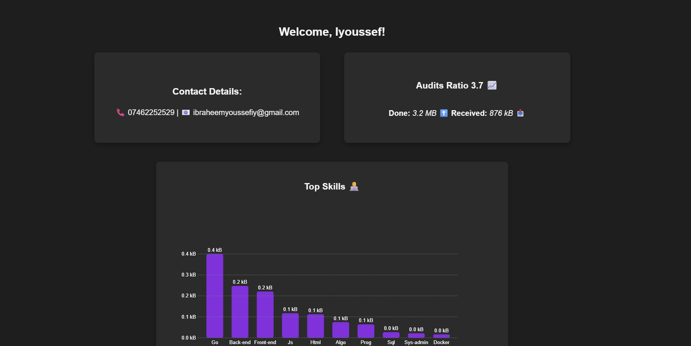

# GraphQL

## 📃 Table of Contents
  - [Project Description](#project-description)
  - [Prerequisites \& Usage](#prerequisites--usage)
    - [🔧 Prerequisites](#-prerequisites)
    - [💻 Running the Project Locally](#-running-the-project-locally)
    - [🌐 Hosted Version](#-hosted-version)

  - [📁 File/Folder Structure](#-filefolder-structure)
  - [🗃️ Directory Responsibilities \& Modular Design](#️-directory-responsibilities--modular-design)

  - [Key Features](#key-features)
  - [📸 UI Visuals](#-ui-visuals)
    - [🔐 Login Page](#-login-page)
    - [🧑‍💻 Profile Dashboard](#-profile-dashboard)
    - [📈 XP Progression Chart](#-xp-progression-chart)
  - [🔧 Areas of Developer Growth](#-areas-of-developer-growth)


## Project Description

**GraphQL** is a student profile dashboard that fetches and visualises coding progress from the **O1 Founders** platform using the GraphQL query language. The main objective of the project is to build a sleek, responsive profile UI 🌐 that presents data to authenticated users of the **01 edu** platform. The data includes:

- ✅ **Audit ratio**
- 🧠 **Top skill categories**
- 📈 **XP progression over time**

As part of this project, you will learn how to:

- Use **GraphQL** to query structured data from an endpoint
- Securely interact with APIs using **JWT tokens**
- Handle and render dynamic data through **SVG-based charts**

This project also places strong emphasis on **frontend design**, incorporating a **dark grey and purple UI theme** that reflects the coding school’s branding. It offers a real-world learning experience in integrating data, logic, and design—equipping you with practical skills in modern web development.

### 🧰 Tech Stack

- **HTML** – Page structure and layout 
- **CSS** - Styling and visual presentation
- **Javascript** - Core logic and interactivity
- **SVG** - Graph rendering for skills and XP charts
- **GraphQL** - Querying user data from the 01F platform

## Prerequisites & Usage

To view or run this project locally, ensure you have the following:

### 🔧 Prerequisites

- [Visual Studio Code](https://code.visualstudio.com/) (or any other code editor)
- The **Live Server** extension for VS Code (or similar tool to serve static pages)
- A stable internet connection
- Valid **01 Founders login credentials** (for accessing personal data)

---

### 💻 Running the Project Locally
1. **Clone the repository** 
    ```bash
    git clone https://github.com/IbsYoussef/GraphQL.git
    cd GraphQL
    ```

2. **Open in VS code**

    Open the project in **Visual Studio Code**.

3. **Start Five Server**

- Right-click on `index.html` inside the /pages folder
- Select **"Open with Five Server"**

4. **Access the Application**

- Navigate to the browser tab that opens (or visit: `http://127.0.0.1:5500/pages/index.html`)
- Log in with your **O1 Founders credentials** to view your dashboard

---

### 🌐 Hosted Version

> [🔗 Application Link – Coming Soon]

If you're a student of the **01 Founders coding program**, you can also access the live version of this application via the link above.  
Simply log in using your platform credentials to view your personal **audit ratio**, **skill growth**, and **XP progression**.

## 📁 File/Folder Structure

Below is an overview of the project's directory structure and how it is organized:

```
.
├── README.md
├── assets
│   ├── css
│   │   ├── index_styles.css
│   │   └── profile_styles.css
│   ├── images
│   │   ├── 01-edu-poster.png
│   │   ├── 01-edu.png
│   │   ├── 01-edu2.png
│   │   ├── login-page.png
│   │   ├── profile-page.png
│   │   └── xp-stats-page.png
│   └── js
│       ├── api.js
│       ├── app.js
│       ├── auth.js
│       ├── graph.js
│       └── utils.js
├── docs
│   └── requirements.md
└── pages
    ├── index.html
    └── profile.html

7 directories, 17 files
```

## 🗃️ Directory Responsibilities & Modular Design

### `assets/`

- **`css/`**  
  Holds separate CSS files for the landing/login page and profile dashboard.

- **`images/`**  
  Includes logos and branding visuals related to the 01 Founders platform.

- **`js/`**  
  Contains core logic:
  - `api.js`: Sends GraphQL queries to the API using the user’s JWT token.
  - `auth.js`: Handles login, authentication, and token storage.
  - `app.js`: Entry point for loading logic, data, and interactivity.
  - `graph.js`: Generates SVG charts for XP and skill visualization.
  - `utils.js`: Utility functions to help parse and display data cleanly.

---

### `docs/`
Planning material and internal documentation.

- `requirements.md`: Outlines the core deliverables and goals of the project.

---

### `pages/`
HTML files served by the Live Server.

- `index.html`: The login screen where users authenticate.
- `profile.html`: The main dashboard showing the user’s progress stats.

---

This modular layout separates logic, content, and style, making the codebase easier to maintain and extend.

## Key Features

- 🔐 **User Authentication**:
    Log in securely using your 01 Founders platform credentials. JWT tokens are used to authorize access to user-specific data.

- 📊 **GraphQL-Powered Dashboard**: 
    All user stats (audit ratio, skill categories, XP progression) are fetched via GraphQL queries from the 01F endpoint.

- 🖼️ **SVG-Based Data Visualisation**:
    Skill and XP data are displayed using custom SVG graphs that provide a dynamic, clear represenation of growth and performance.

- 🧠 **Modular Frontend Architecture**: Javascript files are seperated by responsibility (e.g API interaction, auth, graph rendering), making the codebase easy to maintain and expand.

- 🖌️ **Stylish UI with 01F Branding**: The application uses a clean dark grey and purple colour scheme to align with the coding school's branding, enhancing visual consistency.

- ⚙️ **Live Server Compatible**
    Easily preview the project locally using the Live Server extension in VS Code --- no complex setup required. 

## 📸 UI Visuals

### 🔐 Login Page
A simple and clean login screen where 01 Founders students can enter their credentials


---

### 🧑‍💻 Profile Dashboard

After logging in, users are redirected to their personalised dashboard.



---

### 📈 XP Progression Chart
A smooth SVG line chart that visually tracks the student’s XP growth over time.


---

These visuals highlight the minimalist dark-themed UI, enriched with SVG graphs and modular components, designed for clarity and ease of use.

## 🔧 Areas of Developer Growth

This project has been a great step forward in learning a new API web-driven applications. That said there is still many areas I'd like to explore and improve as I continue developing:

- 🔄 **Expand API Queries & Data Scope** 
    At present, I only query and display skills and xp growth data, in the future I plan to query more fields from the GraphQL API and give users access to a much broader range of insights -- including audit history, completed projects, or streak stats.

- 📊 **Make the Dashboard More Informative & Accessible**
    While the current UI is clean and visually consistent, I'd like to improve accessibility (contrast, ARIA roles, screen reader compatibility) and offer more meaningful visuals, perhaps with filters or data grouping options.

- 🧱 **Introduce a Backend with Node.js**
    Adding a Node.js backend could allow for pre-processing data, session handling, and potentially proxying API requests foor better security and performance.

- 🐳 **Containerization with Docker**
    To improve portability and deployment, I plan to containerize the app using Docker so it can be easily run across environments or shared with others.

- ⚡ **Increase/Optimise Asynchronicity & Performance**
    I could stand to optimise asynchronous operations and loading states to speed up interactions and reduce wait time even further.

- ✅ **Implement Testing Linting Tools**
    Adding automated tests (unit/UI) and linting would ensure cleaner code and help catch issues earlier in development.